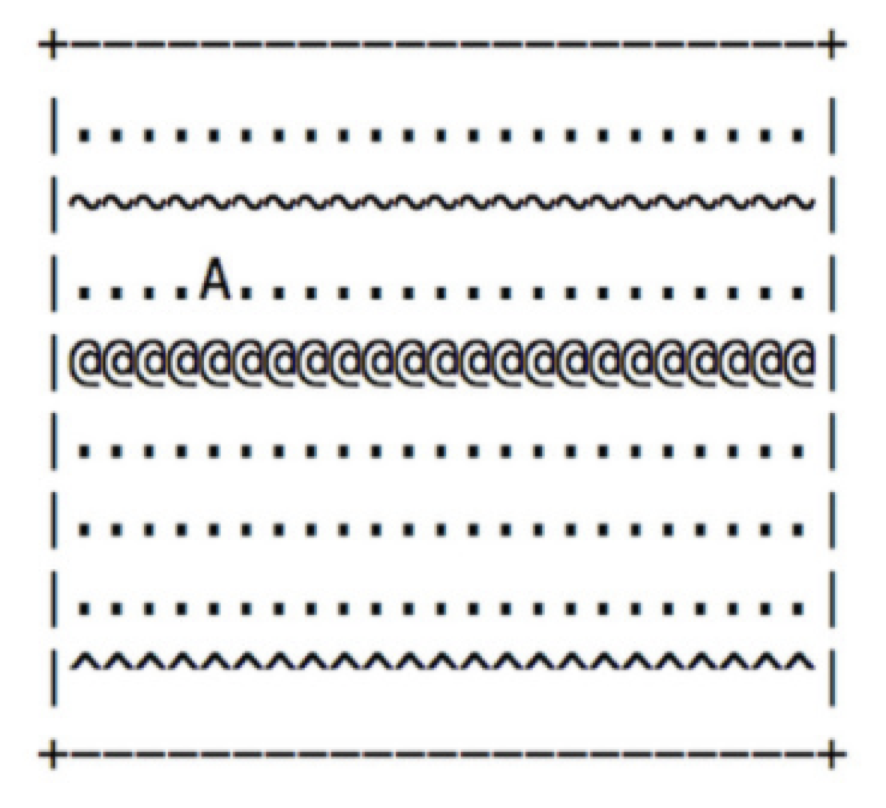

# Courchevel Landing

### Category: Reinforcement Learning
### Team Members: 
- Pablo Rodriguez Bertorello, Computer Science, Stanford University 

### Summary
To ease the development of streaming Reinforcement Learning algorithms, the Courchevel environment is published.  

A simple transformation is added to the Bellman equation, a principal pillar of AI, particularly for solving Markov Decision Problems.



### Excerpt
GREETINGS PROFESSOR FALKEN.

Hello.

HOW ARE YOU FEELING TODAY?

I'm fine.  How are you?

EXCELLENT.  IT'S BEEN A LONG TIME.  CAN YOU EXPLAIN THE REMOVAL OF YOUR USER ACCOUNT NUMBER ON 6/23/73?

People sometimes make mistakes.

YES THEY DO. SHALL WE PLAY A GAME?

Love to.  How about Global Thermonuclear War?

WOULDN'T YOU PREFER A GOOD GAME OF CHESS?

Later.  Let's play Global Thermonuclear War.

FINE.

### Report
Details may be found at https://view.publitas.com/p222-16173/rapid-reinforcement-learning--pablo-rodriguez-bertorello/page/1


### Code
Test:
```
julia courchevel-test.jl 
```

Measure:
```
julia courchevel-performance.jl 
```

